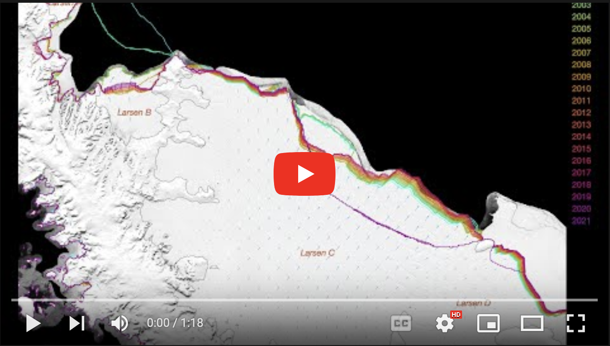

# Antarctic Ice Shelf Calving, 1997-2021
This repo contains Antarctic coastline data and the Matlab scripts we developed to use all available observations we can find, to build an uninterrupted, high-resolution coastline.

Here's an animation of the final product: 

## Figures & Animations
</img> </img>

### The [animations](animations) folder contains: 
* 19 regional animations of coastal evolution from 1997 to 2021. 
* 1 animation of the modeled velocity response to hypothetical ice shelf collapse scenarios. 

### The [regional maps](figures/iceshelf_change_regional_maps) folder contains: 
* 19 regional high-resolution static maps of coastal evolution from 1997 to 2021.

### The [figures](figures) folder contains: 
* every figure from the *Greene et al.,* 2022 manuscript.

## Data 
### Final [Data](data) Products
* Text files of ~annual Antarctic coastlines. The decimal year corresponding to each mapping is in each filename. 
* Gridded ~annual Antarctic coastlines in the `icemask_composite.mat` file at 240 m resolution. If you're using Python, check out the options for reading a .mat file [here](https://www.delftstack.com/howto/python/read-mat-files-python/). 
* `greene_iceshelf_area_and_mass.xlsx` contains time series of every ice shelf's area and mass. 
* `calving_flux_timeseries.mat` contains a .mat form of the data that goes into the Excel spreadsheet. 
* The `issm_gl_flux_strict.mat` contains modeled grounding line flux responses to various test cases. In it the `glf_0` variable is the control run. `glf_cp` contains the response to past calving, `glf_cf` contains the reponses to hypothetical future calving from 0 to 100 percent ice shelf loss by area. `glf_tp` is the response to past thinning, and `glf_tf2` is the respones to hypothetical future thinning (where the very last entry is the 1 m ice shelf case everywhere). 

### Intermediate Data Products
Due to file size limitations, we can't upload all of the intermediate data products that were created along the way to the final product, but their descriptions are presented here for posterity:

These scripts work together to create a dataset `extruded_antarctica_*.h5`, which is currently on devon at `/mnt/devon-r2/shared_data/greene`. The data in the h5 file include: 

* **`vx, vy`**: Velocity components extended beyond present-day coastlines to fill the entire map. Velocity _magnitude_ is constantly extrapolated from the perimeter of observed velocities. Velocity _direction_ is obtained by the Matlab `inpaint_nans` algorithm applied to measured velocity multiplied by measured thickness. 
* **`v_source`**: Sources of the velocity components are:
	1. [ITS\_LIVE](https://nsidc.org/apps/itslive/) ([Gardner et al., 2018](https://doi.org/10.5194/tc-12-521-2018)), 
	2. [MEaSUREs v2](https://nsidc.org/data/NSIDC-0484/versions/2) ([Rignot et al., 2017](https://doi.org/10.5067/D7GK8F5J8M8R)), 
	3. Error-weighted mean of ITS\_LIVE and MEaSUREs v2. 
	4. Interpolation, and
	5. Extrapolation. 
* **`thickness`**: Ice thickness extrapolated beyond present-day coastlines to fill the entire map. 
* **`thickness_source`**: Sources of the thickness data are prioritized in the following order, which uses the newest data available, and fills in recently calved areas (such as Larsen B) with older datasets. Mean firn air content from the Glacier Energy and Mass Balance (GEMB) model (ISSM and Gardner's thesis) was subtracted from surface elevation datasets before inverting for thickness (multiply geoid-referenced surface by 9.3364). The BedMachine thickness product is the basis, but all other "thickness" observations are inverted surface elevations. 
	1. BedMachine Antarctica (Morlighem et al., 2020), 
	2. REMA - GEMB, 
	3. Bedmap2 - GEMB, 
	4. Bamber - GEMB, 
	5. RAMP2 - GEMB
* **`iceshelf_mask`**: Mask of 181 ice shelves from [Mouginot et al., 2017](https://doi.org/10.5067/AXE4121732AD), dilated by `iceshelf_mask_generator.m` and extruded by `flow_dem_extend.m`. 

## Script Workflow 
1. **`iceshelf_mask_generator.m`** uses Mouginot's iceshelves\_2008\_v2 outlines to create `iceshelf_mask.mat`, which contains a 240 m resolution mask on the ITS\_LIVE. This script also dilates the ice shelf mask by 100 km to account for any possible ice shelf growth. *This mask is not a final product!* It is modified by `flow_dem_extend.m` to create the `iceshelf_mask` in the `extruded_antarctica_*.h5` file. 
2. **`flow_dem_extend.m`** creates reference ice thickness and velocity grids that extend 100 km beyond the ~2008 extents of the ice sheet. Velocity is obtained by combining ITS\_LIVE and MEaSUREs v2 data as an error-weighted average of the two datasets, then velocities are extrapolated as constant values ~100 km beyond the calving front, in the direction of ice flow. Ice thickness is inverted from BedMachine v2 surface elevations (which are REMA - FAC). Where calving occurred before the ~2014? nominal date of BedMachine and BedMachine contains 0 thickness, surface elevations are taken from REMA, then Bedmap2, then Bamber DEM, then RAMP2, and from each of these non-BedMachine surface elevations, FAC from GEMB is subtracted.  
3. **`extruded_antarctica_plotter.m`** creates the five maps shown above. 
4. **`icemask_modis.m`** reads and interpolates Alex Fraser's annual modis coastline. Writes the resulting ice cube to a file called `icemask_modis.mat`. 
5. **`icemask_s1a.m`** reads and interpolates Alex Fraser's annual ice mask that was generated from Sentinel 1a. Writes the resulting ice cube to a file called `icemask_s1a.mat`. 
6. **`icemask_ramp2.m`** masks the its-live grid using the 1997 AMM-1 (`after_coast_continuous.shp`) and 2000 MMAM (`cst2000line.shp`) annual modis coastline. Writes the resulting ice cube to a file called `icemask_ramp2b.mat`. 
7. **`icemask_moa.m`** masks the its-live grid using the 2004, 2009, and 2014 coastlines. Writes the resulting ice cube to a file called `icemask_moa.mat`.
8. **`icemask_compiler.m`** Combines masks from individual sensors to create a composite, fully consistent ice cube. This script creates `icemask_composite.mat`, which is used in the ISSM experiment on grounding line flux response to observed calving. 
9. **`icemask_analysis.m`** Analysis of coastal extent change.
10. **`icemask_animator.m`** Creates regional gifs and still maps of the observed calving tha occurred from 1997-2021.  
11. **`icemask_buffer.m`** creates an "ice cube" of masks that buffer inland in small increments, 1% of each ice shelf's area at a time. This script creates `icemask_buffered.mat`, which is used in the hypothetical calving ISSM experiment. 
12. **`iceshelf_thickness_cube_generator.m`** creates thickness cubes on the 240 ITS_LIVE velocity grid, annually for for the observed period 1992-2018, and every two years for the next 50 years, if trends from the past quarter century continue. (Trends from the pole hole only covered by CryoSat-2 are calculated for 2010-2018). This script creates `iceshelf_thickness_cube_1992-2018.mat` and `iceshelf_thickness_cube_future.mat`, which are for the ISSM past and "future" thickness-change experiments.  
13. **`issm_calving_melt_setup.m`** sets up the geometry to initialize the ISSM experiment. This script creates `issm_calving_melt_setup.mat`. 
14. **`calving_flux_calculation_cartoon.m`** creates this figure to explain how steady-state calving flux is calculated:  
15. **`issm_thickness_response_analysis.m`** converts the modeled response velocities at each ISSM node into grounding line flux. This script creates `issm_gl_flux_strict.mat`, which is called by all the other ISSM plotting scripts.  

## Functions and other files 
* **`inpolygon_map()`** is a _much_ faster version of `inpolygon` and is used by `iceshelf_mask_generator.m` to mask ice shelf boundaries. 
* **iceshelves\_2008\_v2\_names.csv** contains the names and numerical indices of all 181 ice shelves in the extended ice shelf mask. 
* **README\_issm\_model\_setup\_files.txt** Notes on the ISSM experiment setup with descriptions of the variables and how they were created. 
* **reference\_coastline\_logbook.xls** a reference to help me keep straight which indices of which ice cube masks correspond to which years. 

## Citation 
The data and code in this repository all go along with a manuscript that is currently in review. If you use this data, please get in touch with me or check back here for the latest citation information. 

