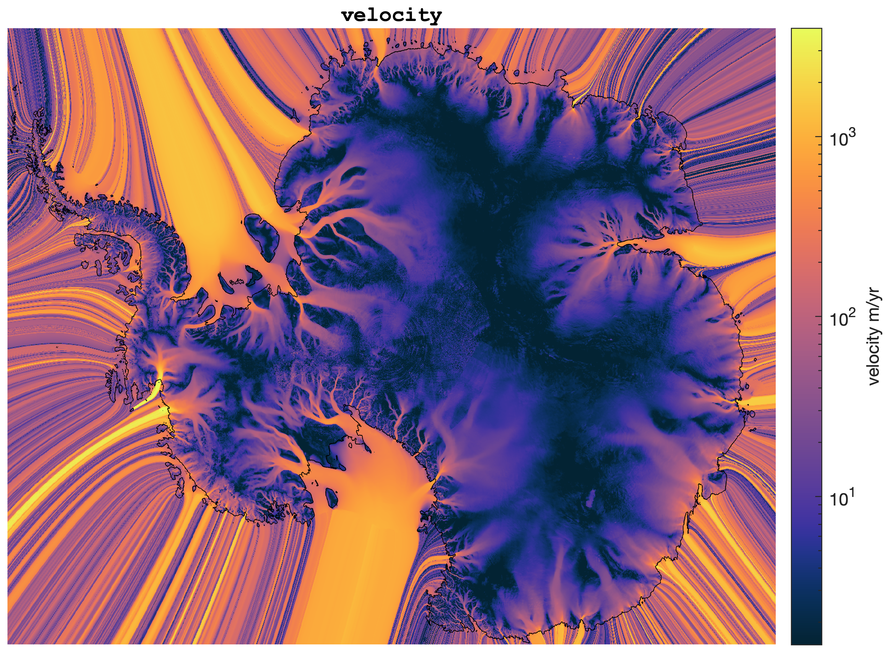
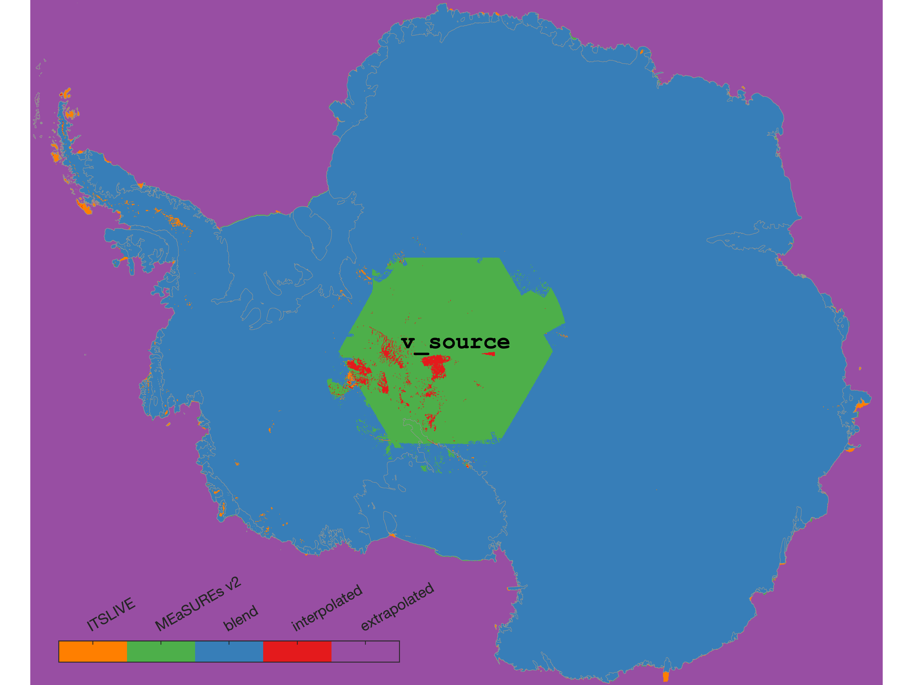
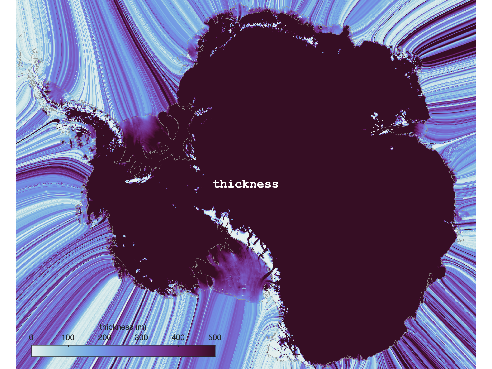

# ice-shelf-geometry
Matlab scripts that use all available observations to grow and trim the extents of Antarctic ice shelves.

## Data Products
These scripts work together to create a dataset `extruded_antarctica_*.h5`, which is currently on devon at `/mnt/devon-r2/shared_data/greene`. The data in the h5 file include: 

* **`vx, vy`**: Velocity components extended beyond present-day coastlines to fill the entire map. Velocity _magnitude_ is constantly extrapolated from the perimeter of observed velocities. Velocity _direction_ is obtained by the Matlab `inpaint_nans` algorithm applied to measured velocity multiplied by measured thickness. 

* **`v_source`**: Sources of the velocity components are:
	1. [ITS\_LIVE](https://nsidc.org/apps/itslive/) ([Gardner et al., 2018](https://doi.org/10.5194/tc-12-521-2018)), 
	2. [MEaSUREs v2](https://nsidc.org/data/NSIDC-0484/versions/2) ([Rignot et al., 2017](https://doi.org/10.5067/D7GK8F5J8M8R)), 
	3. Error-weighted mean of ITS\_LIVE and MEaSUREs v2. 
	4. Interpolation, and
	5. Extrapolation. 

* **`thickness`**: Ice thickness extrapolated beyond present-day coastlines to fill the entire map. 

* **`thickness_source`**: Sources of the thickness data are prioritized in the following order, which uses the newest data available, and fills in recently calved areas (such as Larsen B) with older datasets. Mean firn air content from the Glacier Energy and Mass Balance (GEMB) model (ISSM and Gardner's thesis) was subtracted from surface elevation datasets before inverting for thickness (multiply geoid-referenced surface by 9.3364). The BedMachine thickness product is the basis, but all other "thickness" observations are inverted surface elevations. 
	1. BedMachine Antarctica (Morlighem et al., 2020), 
	2. REMA - GEMB, 
	3. Bedmap2 - GEMB, 
	4. Bamber - GEMB, 
	5. RAMP2 - GEMB

* **`iceshelf_mask`**: Mask of 181 ice shelves from [Mouginot et al., 2017](https://doi.org/10.5067/AXE4121732AD), dilated by `iceshelf_mask_generator.m` and extruded by `flow_dem_extend.m`. 

## Script Workflow 
1. **`iceshelf_mask_generator.m`** uses Mouginot's iceshelves\_2008\_v2 outlines to create `iceshelf_mask.mat`, which contains a 240 m resolution mask on the ITS\_LIVE. This script also dilates the ice shelf mask by 100 km to account for any possible ice shelf growth. *This mask is not a final product!* It is modified by `flow_dem_extend.m` to create the `iceshelf_mask` in the `extruded_antarctica_*.h5` file. 
2. **`flow_dem_extend.m`** creates reference ice thickness and velocity grids that extend 100 km beyond the ~2008 extents of the ice sheet. Velocity is obtained by combining ITS\_LIVE and MEaSUREs v2 data as an error-weighted average of the two datasets, then velocities are extrapolated as constant values ~100 km beyond the calving front, in the direction of ice flow. Ice thickness is inverted from BedMachine v2 surface elevations (which are REMA - FAC). Where calving occurred before the ~2014? nominal date of BedMachine and BedMachine contains 0 thickness, surface elevations are taken from REMA, then Bedmap2, then Bamber DEM, then RAMP2, and from each of these non-BedMachine surface elevations, FAC from GEMB is subtracted.  
3. **`extruded_antarctica_plotter.m`** creates the five maps shown above. 

## Functions and other files 
* **`inpolygon_map()`** is a _much_ faster version of `inpolygon` used by `iceshelf_mask_generator.m` to mask ice shelf boundaries. 
* **iceshelves\_2008\_v2\_names.csv** contains the names and numerical indices of all 181 ice shelves in the extended ice shelf mask. 

